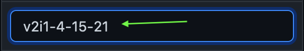

# Reedy Creek Times: Code Documentation

## Table of Contents

- [Overview](#overview)

- [How to Use](#how-to-use)

- [Documentation](#documentation)

    - [Warnings](#warnings)

    - [Website Hosting Delay](#website-hosting-delay)

    - [Code](#code)

    - [New Issue Updating](#new-issue-updating)

    - [Issue Transition](#issue-transition)

    - [All Pages](#all-pages)

    - [Note on Images](#note-on-images)

    - [Home Page](#home-page)

    - [Articles Page](#articles-page)

    - [About Page](#about-page)

    - [Archives Page](#archives-page)

    - [Contact](#contact)

    - [Issues](#issues)

---

## Overview

This file shows the documentation for updating, creating, and deleting the code in the repositery. This document is a reference to the code managers and developers of the website.

---

## How to Use

**Read everything in the order specified below to understand completely.**

1. Read the `Warnings` under the `Documentation`

2. Read the code structure to understand how the code is organized.

2. Thoroughly read the `New Issue Updating` to get an idea of how to change the code when a new issue is released. **This is to get a general idea. Do NOT start editing on your computer or making changes to the repo without reading the docs for the appropriate page (below). ALWAYS MAKE CHANGES IN A NEW BRANCH NOT THE `main` ONE.**

3. Read the `Issue Transition` section to learn about changing issues.

3. Read the section for `All Pages` to understand what all the pages have in common.

4. Read the `Note on Images`:

    - *The image source will be a link*

5. Locate the docs for the page you want to change and read it thoroughly.

6. Read the `Contact` section to learn about `mailto:` links.

7. Look at the `Issues` section for any possible problems.

---

## Documentation

================

### Warnings

- **DO NOTE CHANGE ANYTHING NOT SPECIFIED BY THE DOCUMENTATION.**

- **Read the appropriate documentation of a certain section before making changes to the code for that section.**

- **Please read the [New Issue Updating](#new-issue-updating) section for the steps to changing the GitHub Code for a new issue.**

================

### Website Hosting Delay

**The website is hosted by GithubPages, so after a commit, it may take some time before the website will show on the internet.**

================

### Code

The code repositery is divided into sections. Below is the structure:

<u>master</u>:

- All HTML Files

- README.md

- CSS and Docs folders

<u>master/css</u>:

- All CSS Files

<u>master/Docs</u>:

- *Docs/docs-images*

    - All images in `docs.md`

- `docs.md` - Documentation

================

### New Issue Updating

#### <u>Updating Pages</u>

Steps

1. Make all the necessary changes to all the pages in the text-editor on your computer.

2. In GitHub, locate the following image:

    

    This should be at the top of the code section on the first page.

3. Click the button shown in red above. It should show a result like the image below:

    

    *Note, there might be more branches listed below the `main` branch. And there might be a different number next to the branches number.*

4. In the section that is shown in red, type: `v#i#-date`. **The `#` in front of the `v` and `i` should have the volume and issue number respectively and the date should be the current date.** *The date should be written as: `month-day-year`.* Below is an example of the name for the *Volume: 2, Issue: 1, Date: 4-15-21*:

    

5. Then hit enter. This creates a new branch so any changes here won't affect the main code in the `main` branch.

6. Click any file that ends with a `.html`.

7. Once the file is open, locate the following image near the top right of the file preview.

    

8. Locate the green section and then the red section with the delete button. Click it.

9. Scroll all the way down and hit the green `Commit changes` button.

Then it will take you to the home page.

11. Find the `Add File` button and click it. The go to upload files. The image below shows the process:

    

12. Remember the file you deleted in step 8. Choose that file (which you edited in step 1) and upload it. Then hit the `Commit Changes` button.

13. Repeat stpes 6-12 for all files ending in `.html`. This will update all the pages with the new issue.

#### <u>Release Code</u>

Steps

1. Once all the pages are updated, locate the `Releases` section to the right hand side.

2. Click `Create a new release`.

3. The tag version should be in this form:

    v1.01 - 1st Issue

    v1.05 - 5th Issue

    v1.18 - 18th Issue

    v2.00 - 200th Issue

    **The number should be 1 more than the previous tag.**

4. The release title should be `RC Times: #branch`. The `#branch` should be the branch name, which shows volume, issue, and date.

5. The description can be anything. Nothing else is necessary.

6. Then click `Publish release`.

================

### Issue Transition

Steps (**Follow in order**)

1. Change all the places where the issue information (volume, issue number, date) are with the new information.

2. On the home page, change all the articles to the new top 4 articles.

3. Copy the code for 1 article in the archives page (**See archives section for details**) and paste it on top of the first one.

4. In the new section created for each article on the arcvhies page, copy and paste the info of the previous issues' articles so they are in the archives.

5. Then change the articles on `articles.html` with the current issue.

================

### All Pages

All of the pages have the same header and footer. All pages also have comments at the top to show the key as well as comments where there need to be changes for new articles, issues, and other not changing elements.

================

### Note on Images

Images are included using the `` tag. This tag has 2 main attributes or properties: `src=""` and `alt=""`. `src=""` is used to specify the source of this image and in this case, should be a **link**. `alt=""` is the alternate text that is shown when the image cannot be seen. For both, put the source path/text in between the `""`.

================

### Home Page

`index.html`

**Read the section about the transition in between issues [here](#issue-transition)**

 

#### <u>About</u>

The home page is the landing page that users come to when they go to the website. This is where the top 4 news of the issue are shown and where the users can navigate to different sections.

 

#### <u>Contents</u>

The home page is sorted into 2 main categories. The first contains the 4 main articles of that issue and the button too view the rest of the articles. The second is to explore the webpage with buttons to `about.html`(About Us), `archives.html`(All the News), and `contact.html`(Get in Touch).

 

#### <u>Updating</u>

Eveything on the home page that needs updating when a new issue is released is listed by numbers and have underlined headings as seen below.

1. <u>Issue Info:</u> The first change is the `Volume` number, `Issue` number, and date. The changed code should be in between the `<!--Change...-->` and `<!--**-->` comments.

    Steps:

    1. Locate the code, as shown in the image, in `index.html`.

        

        *Note that the `<!--#-->`should be filled with a number and the `<!--Date-->` should have a date. Also, after the issue number, there should be a `"."`.*

    2. Change the `Volume` number, `Issue` number, and date. **Should be the text section.**

2. <u>Main Articles:</u> This section changes the articles seen on the first page. The very first of these sections should have comments around it with the bottom comment as `<!--**-->`.

    Steps:

    1. Locate the code, as shown in the image, in `index.html`.

        

        *<u>Changes:</u> In both the `<a href="#"`, the `#` should be changed with the link to the PDF(article) that will be shown. **For info on images, go [here](#note-on-images)***In the `` should be replaced with the actual name of the article.*

    2. Apply the changes as stated in the `Changes` section above.

================

### Articles Page

`articles.html`

**Read the section about the transition in between issues [here](#issue-transition)**

 

#### <u>About</u>

The articles page is the page that users come to when they want to see every article in the current issue. This is where all the news of the issue are shown.

 

#### <u>Contents</u>

The articles page is sorted into 2 main categories. The first contains the articles of that issue. The second is to explore the webpage with buttons to `archives.html`(View Past Issues) and `about.html`(About Us).

 

#### <u>Updating</u>

Eveything on the articles page that needs updating when a new issue is released is listed by numbers and have underlined headings as seen below.

1. <u>Issue Info:</u> The first change is the `Volume` number, `Issue` number, and date. The changed code should be in between the `<!--Change...-->` and `<!--**-->` comments.

    Steps:

    1. Locate the code, as shown in the image, in `articles.html`.

        

        *Note that the `<!--#-->`should be filled with a number and the `<!--Date-->` should have a date. Also, after the issue number, there should be a `"."`.*

    2. Change the `Volume` number, `Issue` number, and date. **Should be the text section.**

2. <u>Issue Name:</u> This changes the red banner above the articles that shows the issue information.

    Steps:

    1. Locate the code, as shown in the image, in `articles.html`.

        

        *Note that the `<!--#-->`should be filled with a number and the `<!--Date-->` should have a date. Also, after the issue number, there should be a `"."`.*

    2. Apply the changes as stated in the previous section.

================

### About Page

`about.html`

 

#### <u>About</u>

The about page is the page that users come to when they want to see what RC Times is about and what categories of articles are written.

 

#### <u>Contents</u>

The about page is sorted into 2 categories. The first is the paragraph on what RC Times is. The second is the list of categories of the articles that are written.

 

#### <u>Updating</u>

Eveything on the about page that needs updating when a new issue is released is listed by numbers and have underlined headings as seen below.

1. <u>Issue Info:</u> The first change is the `Volume` number, `Issue` number, and date. The changed code should be in between the `<!--Change...-->` and `<!--**-->` comments.

    Steps:

    1. Locate the code, as shown in the image, in `about.html`.

        

        *Note that the `<!--#-->`should be filled with a number and the `<!--Date-->` should have a date. Also, after the issue number, there should be a `"."`.*

    2. Change the `Volume` number, `Issue` number, and date. **Should be the text section.**

================

### Archives Page

`archives.html`

**Read the section about the transition in between issues [here](#issue-transition)**

 

#### <u>About</u>

The archives page is the page that users come to when they want to see all the articles ever written.

 

#### <u>Contents</u>

The archives page is sorted into 2 categories. The first (left side) is the list of all the articles sorted by date (newest to oldest). The second is the button to the 2019-2020 archives and the excerpt on archives.

 

#### <u>Updating</u>

Eveything on the about page that needs updating when a new issue is released is listed by numbers and have underlined headings as seen below.

1. <u>Issue Info:</u> The first change is the `Volume` number, `Issue` number, and date. The changed code should be in between the `<!--Change...-->` and `<!--**-->` comments.

    Steps:

    1. Locate the code, as shown in the image, in `archives.html`.

        

        *Note that the `<!--#-->`should be filled with a number and the `<!--Date-->` should have a date. Also, after the issue number, there should be a `"."`.*

    2. Change the `Volume` number, `Issue` number, and date. **Should be the text section.**

2. <u>Add Archive:</u> Adding the articles from the previous issue to the archives section.

    Steps:

    1. Locate the code, as shown in the image, in `archives.html`.

        

    Follow the steps in purple in the previous image. *Note that the Date should be in `month/day/year` format*

================

### Contact

Every button or link that is about contacting RC Times, including the email at the bottom is a `mailto:` link. When clicked, this opens the users email cliet, which is the email app that they have on their device, and puts the `to:` to the RC Times teacher email.

================

### Issues

Sometimes, there can be minor issues with the code, below are some issues to look out for.

1. <u>`mailto:` issue</u> -  The `mailto:` link, which is used for all contact links, will cause an issue if the user does not have an email client (email app) on their device. Then the link will not work.

    **Solution:** If the user can contact RC Times through other means, and if they report this problem, then tell them to look in the footer (dark area) for the email.
